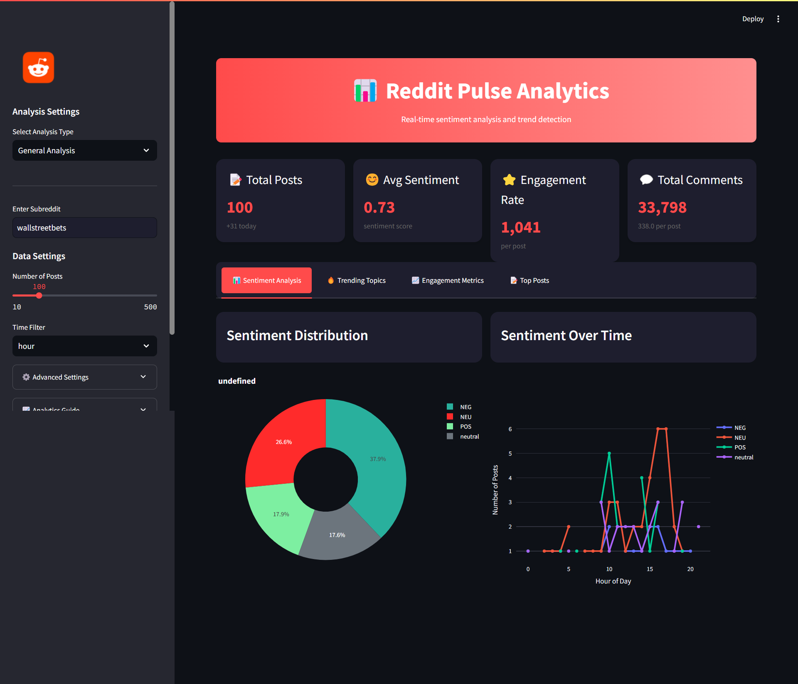
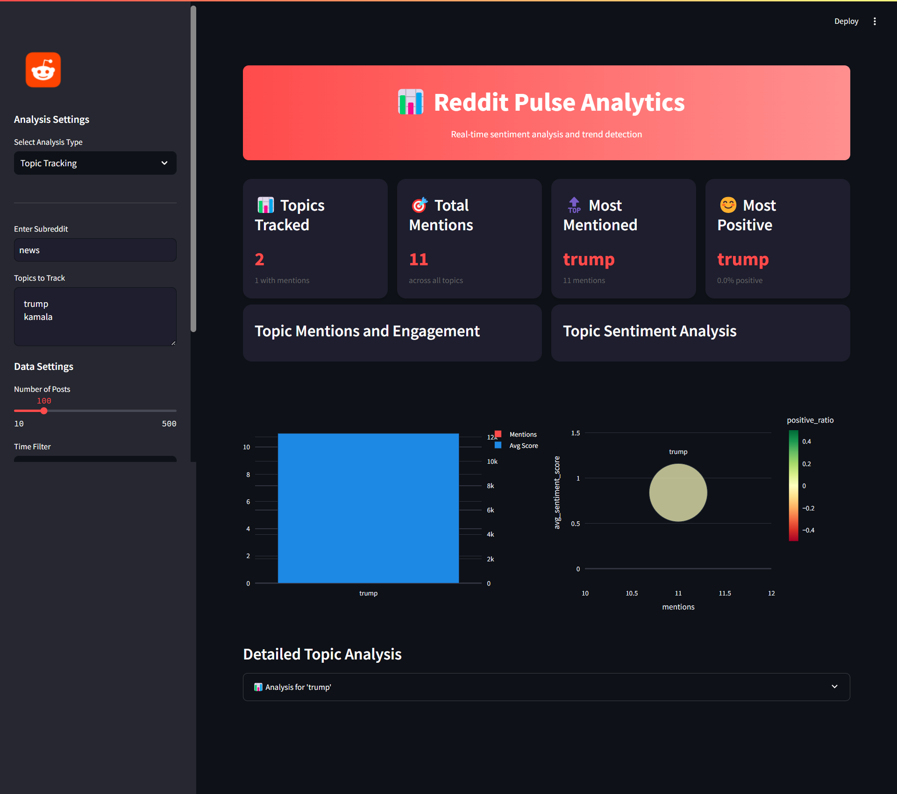
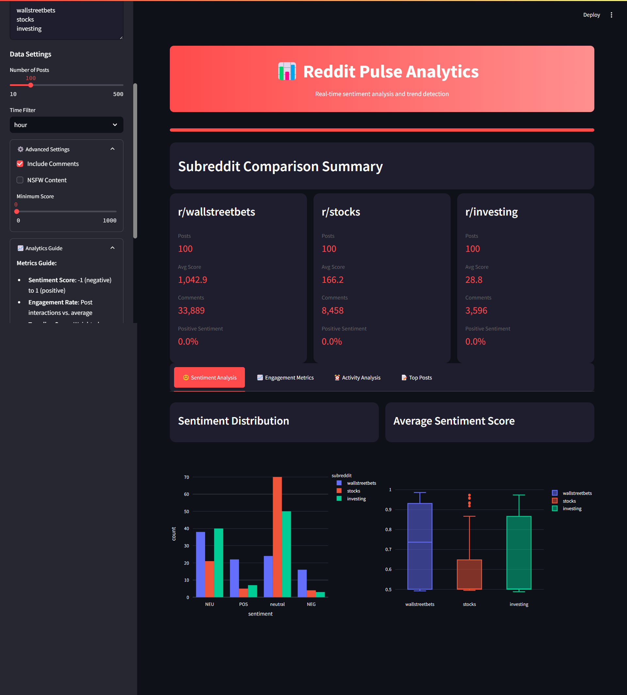

# Reddit Pulse Analytics 📊

A modern, real-time dashboard for analyzing Reddit sentiment, trends, and engagement metrics. Built with Streamlit and powered by advanced NLP and data science techniques.





## 🚀 Quick Start

Clone the repository
bash
git clone https://github.com/abheda24/Reddit-Pulse-Analytics.git
cd reddit_sentiment_analysis

Create virtual environment
bash
python -m venv venv
source venv/bin/activate  # Linux/Mac
venv\Scripts\activate     # Windows

Install dependencies
bash
pip install -r requirements.txt

Set up environment variables
bash
cp .env.example .env
# Edit .env with your Reddit API credentials

Run the dashboard
bash
streamlit run app/dashboard.py

## 🔧 Configuration

Create a Reddit application at https://www.reddit.com/prefs/apps
Add credentials to .env: env
REDDIT_CLIENT_ID=your_client_id
REDDIT_CLIENT_SECRET=your_client_secret
REDDIT_USER_AGENT=RedditPulseAnalytics/1.0

## 🌟 Technical Features & Data Science Components

### 1. Data Collection & Processing
- **Reddit API Integration**: Real-time data fetching using PRAW
- **Data Preprocessing**: Text cleaning, normalization, and feature engineering
- **Dynamic Data Caching**: Optimized data storage for faster analysis
- **Batch Processing**: Handles 500+ posts simultaneously

### 2. Natural Language Processing
- **Sentiment Analysis**: 
  - BERT-based transformer models
  - TextBlob for fallback analysis
  - Custom sentiment scoring algorithm
- **Text Analysis**:
  - Topic modeling
  - Keyword extraction
  - Named entity recognition
  - Emoji/emoticon interpretation

### 3. Statistical Analysis
- **Engagement Metrics**:
  - Z-score based anomaly detection
  - Time series analysis
  - Correlation analysis
  - Distribution analysis
- **Trend Detection**:
  - Moving averages
  - Peak detection
  - Seasonality analysis

### 4. Data Visualization
- **Interactive Charts**: 
  - Plotly for dynamic visualizations
  - Real-time data updates
  - Custom color schemes
- **Advanced Visualizations**:
  - Sentiment heatmaps
  - Word clouds
  - Network graphs
  - Time series plots

### 5. Machine Learning Components
- **Models Used**:
  - BERT for sentiment analysis
  - Topic modeling with LDA
  - Custom score prediction
- **Feature Engineering**:
  - Text vectorization
  - Temporal features
  - Engagement metrics
  - Custom indicators

### 6. Performance Optimization
- **Efficient Processing**:
  - Parallel processing for batch analysis
  - Caching mechanisms
  - Memory optimization
  - Query optimization

[Rest of your README remains the same until Technology Stack]

## 🛠️ Technology Stack & Skills Demonstrated

### Data Science & Analysis
- **Python Data Stack**: 
  - Pandas for data manipulation
  - NumPy for numerical computations
  - Scikit-learn for machine learning
  - SciPy for statistical analysis

### Natural Language Processing
- **Text Processing**:
  - NLTK for text preprocessing
  - Hugging Face Transformers
  - TextBlob for basic NLP
  - Custom NLP pipelines

### Data Visualization
- **Libraries**:
  - Plotly for interactive charts
  - Matplotlib for static plots
  - Seaborn for statistical viz
  - WordCloud for text viz

### Backend Development
- **API Integration**:
  - PRAW (Reddit API)
  - RESTful API design
  - Error handling
  - Rate limiting

### DevOps & Testing
- **Quality Assurance**:
  - Pytest for unit testing
  - Coverage reporting
  - Integration testing
  - Performance testing

## 🧪 Testing

Run the test suite:
```bash
# Run all tests with coverage
pytest tests/ -v --cov=src --cov=app

# Run specific test file
pytest tests/test_dashboard_functionality.py -v
```

## 📊 Data Science Skills Demonstrated

1. **Data Collection & Processing**
   - API Integration
   - Data Cleaning
   - Feature Engineering
   - ETL Pipelines

2. **Analysis & Modeling**
   - Statistical Analysis
   - Machine Learning
   - NLP & Text Mining
   - Time Series Analysis

3. **Visualization & Presentation**
   - Interactive Dashboards
   - Statistical Plots
   - Real-time Visualization
   - Data Storytelling

4. **Software Engineering**
   - Clean Code Principles
   - OOP Design
   - Testing & Documentation
   - Performance Optimization

Project Link: [https://github.com/abheda24/Reddit-Pulse-Analytics](https://github.com/abheda24/Reddit-Pulse-Analytics)